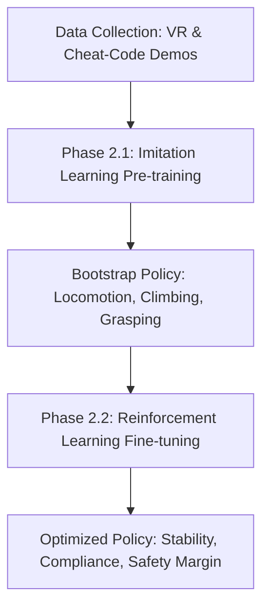

# Fiatlux Project Phase 2 Plan: Policy Training & Learning Infrastructure

This document outlines the formalized plan for Phase 2 of the Fiatlux Benchmark. Phase 2 is dedicated to implementing the training infrastructure, collecting demonstrations, and training policy models to solve the energy infrastructure subtasks and combined tasks in simulation.

---

## 1. Hybrid Learning Strategy

To solve the complex combination of humanoid climbing and compliance-sensitive manipulation, Phase 2 will utilize a **hybrid learning paradigm**:

### Phase 2.1: Imitation Learning (IL) Pre-training
* **Goal**: Bootstrap the G1 humanoid's basic locomotion, climbing coordination, and reaching/grasping primitives. Training from scratch using RL on sparse rewards is highly sample-inefficient for humanoids.
* **Approach**: Train policies (e.g., Action Chunking with Transformers (ACT) or Diffusion Policies) on demonstration datasets to establish stable base behaviors.

### Phase 2.2: Reinforcement Learning (RL) Fine-tuning
* **Goal**: Fine-tune the pre-trained policy to optimize stability, conform to contact force limits, and learn compliant screw-in/screw-out control.
* **Approach**: Use PPO (via `rsl_rl`) initialized with the imitation policy. Apply reward shaping and penalty terms to enforce safety boundaries.

---

## 2. Demonstration Data Collection Pipeline

We will support two demonstration recording pathways to build the pre-training datasets:

### A. VR Headset Teleoperation
* **Interface**: Map the G1 humanoid's arms, hands (Inspire), and head to VR controllers and headset tracking.
* **Usage**: Allows human operators to demonstrate complex, non-trivial dual-arm manipulation tasks (e.g., aligning the bulb threads, climbing rungs) naturally.

### B. "Cheat Code" Controller Data Generation
* **Interface**: Programmatic heuristic controllers that leverage ground-truth environment states (e.g., exact ladder rung poses, socket thread vectors, bulb center-of-mass) rather than relying on noisy camera/proprioceptive feeds.
* **Usage**: Allows fast, automated generation of thousands of perfect demonstration trajectories in simulation without requiring a human operator.

### Dataset Specification
* All demonstrations (actions, joint velocities, joint torques, camera feeds, force-torque readings) will be recorded and formatted into structured HDF5 or **LeRobot** datasets.

---

## 3. Reward Engineering & Curriculum Design

### Reward Components for PPO Fine-tuning
1. **Locomotion and Climbing**:
   - Progressive height rewards along the ladder Z-axis.
   - Hand-rung contact rewards (promoting secure holds).
   - Center of Mass (CoM) alignment penalties (minimizing sway and fall risk).
2. **Manipulation (Bulb Replace)**:
   - Distance-to-target reach rewards for the hands.
   - Rotational alignment rewards for screwing/unscrewing.
   - Compliance force/torque regularization (penalizing high contact forces that could break the bulb/socket).
3. **Verification/Inspection**:
   - Accuracy reward for publishing correct classification states.

### Curriculum Learning Phases
* **Stage 1 (Manipulation Only)**: Robot starts positioned directly at the top platform. Focus is exclusively on bulb unscrewing, insertion, and inspection.
* **Stage 2 (Climbing Only)**: Robot starts at the base. Focus is exclusively on climbing up to the platform and maintaining balance.
* **Stage 3 (Full Chain)**: Start from the base, walk, climb, replace bulb, inspect, and descent/return.

---

## 4. Monitoring & Logging

* **Validation Environments**: Set up a validation task environment that runs parallel evaluation trials during training.
* **Metrics Tracked**:
  - Success Rate (Level 1 and Level 2).
  - Torque Efficiency (integrated torques squared).
  - Peak contact forces on rungs and socket.
  - Average climb velocity.
* **Logging Integration**: Real-time logging of loss curves, reward breakdowns, and success ratios to **Weights & Biases** or **TensorBoard**.
