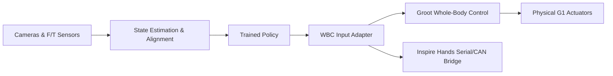

# Fiatlux Project Phase 3 Plan: Sim-to-Real Gap Closure

This document outlines the formalized plan for Phase 3 of the Fiatlux Benchmark. Phase 3 assumes a policy has been pre-trained and validated in simulation (Phase 2) and focuses on the infrastructure, calibration, and driver adapters required to transfer this policy to the physical Unitree G1 humanoid robot.

---

## 1. Physical Environment & Hardware Setup

The physical deployment room contains:
* **Humanoid Robot**: Unitree G1 humanoid robot equipped with two **Inspire dexterous hands**.
* **Scene Objects**: A real industrial/household ladder, a lamp fixture mounted at height, and a screw-in light bulb.
* **Onboard/Offboard Compute**: A local compute station running ROS 2 to run the policy model (CPU/GPU) and communicate with the robot's onboard computer.

---

## 2. Infrastructure Required for Sim-to-Real Transition

To close the sim-to-real gap and safely execute the simulation-trained policy on physical hardware, the following infrastructure must be implemented:

### A. Hardware Driver & Controller Adapter (Policy Action Interface)
* **WBC Target Mapper**: Since Groot WBC abstracts low-level motor commands (Unitree SDK 2 mapping, joint limits, self-collision), we need a bridge to map the policy's action outputs (e.g. Cartesian end-effector targets or joint trajectories) to Groot WBC's ROS 2 input topics.
* **Inspire Hands Serial Bridge**: Implement a serial/CAN bus driver wrapper to send finger command targets directly to the Inspire dexterous hands.
* **E-Stop Safety Wrapper**: Set up high-level safety monitors that check for anomalous acceleration or excessive wrist F/T sensor forces, sending a trigger command to engage Groot WBC's built-in emergency braking/E-stop modes.

### B. Perception Alignment & State Estimation (Policy Observation Interface)
* **Object Localization**: Set up vision tracking (e.g., ArUco markers or depth-based segmentation models like YOLO) using the G1's wrist and head-mounted cameras to detect:
  - Relative pose of the ladder rungs.
  - Position and angle of the lamp socket.
  - 3D pose of the light bulb.
* **Coordinate Mapping**: Convert the real-world segmented object coordinates into the identical observation frames defined in the simulation (`fiatlux_task_env_cfg.py`), supplying the policy with the same observations it expects from simulation.

### C. System Identification & Calibration (SysID)
* **Inference-to-WBC Latency Calibration**: Measure and profile the latency from policy forward pass on the host computer to message receipt by the Groot WBC controller. Inject this round-trip communication delay distribution into the Isaac Lab simulation during Phase 2 training.
* **Camera-to-Hand Calibration**: Calibrate the camera transforms relative to the G1 hand/wrist frames to ensure accurate visual alignment for grasping.
* **WBC State Alignment**: Verify that the floating-base odometry estimated by Groot WBC aligns with the perception system's coordinate frames.

### D. Safety & Fall Prevention Infrastructure (Physical & Software)
* **Physical Gantry/Harness**: A ceiling-mounted or frame-mounted vertical safety tether/harness to catch the G1 humanoid in the event of a slip, loss of balance, or policy failure during climbing.
* **Emergency Stop (E-Stop)**: Set up a dual-path E-Stop system:
  - *Physical E-Stop*: A wireless hardware remote switch that cuts motor power.
  - *Software E-Stop*: A ROS 2 topic listener that catches high-frequency IMU anomalies (e.g., abrupt orientation changes indicating a fall) and commands joint braking.
