# Fiatlux Project Timeline and Milestones

---

## 1. Project Timeline Gantt Chart

The timeline is divided into:
* **[Phase 1: Infrastructure Setup](./phase_1_plan.md)** (Weeks 1–10)
* **[Phase 2: Simulation Policy Training](./phase_2_plan.md)** (Weeks 11–22)
* **[Phase 3: Sim-to-Real Gap Closure](./phase_3_plan.md)** (Weeks 23–36)

```mermaid
gantt
    title Fiatlux Project Timeline (36 Weeks)
    dateFormat  X
    axisFormat  Day %j
    
    section Phase 1: Infrastructure
    Asset Aggregation & Composite Scene :a1, 0, 21d
    Groot WBC Controller Integration    :a2, after a1, 21d
    Engine Orchestration & Metrics      :a3, after a2, 14d
    Pipeline Verification & Teleop      :a4, after a3, 14d
    
    section Phase 2: Simulation Training
    VR & Cheat-code Demo Collection     :b1, after a4, 28d
    Imitation Learning Pre-training     :b2, after b1, 21d
    RL Fine-tuning & Curriculums        :b3, after b2, 21d
    Validation Rollouts                 :b4, after b3, 14d
    
    section Phase 3: Sim-to-Real
    WBC & Inspire Driver Integration    :c1, after b4, 28d
    Perception Bridge & State Estim.    :c2, after c1, 21d
    Safety Gantry & E-Stop Setup        :c3, after c2, 21d
    Real-World Trials & Benchmarking    :c4, after c3, 28d
```

---

## 2. Classification of Task Domains

Rather than locking students into specialized roles, the workload is organized by technical domains. The 5 students will self-organize and coordinate across these boundaries:

### Domain A: Simulation & Scene Composition
* **Focus**: USD model composition, rigid-body physics tuning, and simulation-time environment modifications.
* **Primary tasks**: Combining the G1 and Inspire hands assets; constructing the parameterized ladder and lamp socket geometry; defining domain randomization terms (events) for training.

### Domain B: Humanoid Control
* **Focus**: Low-level motor controllers and whole-body kinematics.
* **Primary tasks**: Binding the Groot WBC SDK inside the ROS 2 controller interface; setting up joints, torques, and Cartesian control loops; implementing the real SDK 2 communication sockets.

### Domain C: Learning & Policy Infrastructure
* **Focus**: Neural network policy architectures, reward optimization, and training loops.
* **Primary tasks**: Building visual/sensory observation pipelines; reward function design and curriculum stages; setting up imitation pre-training (ACT/Diffusion) and RL fine-tuning (PPO).

### Domain D: Perception & State Estimation
* **Focus**: Vision systems, sensor bridges, and coordinate transformation mapping.
* **Primary tasks**: Interfacing wrist/head camera feeds; developing vision tracking (ArUco or segmentation models) to estimate the relative ladder/socket poses; matching physical coordinates with policy observation space.

### Domain E: Orchestration & Scoring
* **Focus**: Simulation orchestrator state machine, scoring, and telemetry tracking.
* **Primary tasks**: Updating the C++ `fiatlux_engine` state machine; creating `fiatlux_scoring` plugins for climbing stability and compliance forces; logging metrics to Weights & Biases.

---

## 3. Weekly Milestones & Deliverables

### [Phase 1: Infrastructure & Subtask Setup](./phase_1_plan.md) (Weeks 1–10)
* **Weeks 1-3 (Asset & Composite Scene)**:
  - Pull and consolidate raw USD/URDF assets of the G1 robot and Inspire hands.
  - Create the composite simulation world `fiatlux_g1_scene.usd` with ladder and lamp sockets.
  - **Milestone 1**: G1 robot and scene assets load correctly in Isaac Sim with functional contact/collision physics.
* **Weeks 4-6 (Groot WBC Controller Integration)**:
  - Connect the Groot WBC to the `fiatlux_controller`.
  - Expose arm/leg action command interfaces (joint, torque, and Cartesian).
  - Update `fiatlux_task_env_cfg.py` with the G1 kinematics constraints.
* **Weeks 7-8 (Engine Orchestration & Metrics)**:
  - Update `fiatlux_engine.cpp` trial setups to spawn the ladder and lamp fixtures.
  - Implement C++ `fiatlux_scoring` plugins for Stability Index and compliance forces.
  - Set up domain randomizations (events) inside Isaac Lab.
* **Weeks 9-10 (Pipeline Verification & Teleop)**:
  - Map teleoperation keyboard controls for climbing steps.
  - Write a simple, rule-based heuristic policy to test the interface.
  - Run a complete trial loop through `fiatlux_engine` to record metric bags.
  - **Milestone 2**: Phase 1 infrastructure complete; dummy policy successfully transitions through the orchestrator.

### [Phase 2: Simulation Policy Training](./phase_2_plan.md) (Weeks 11–22)
* **Weeks 11-14 (VR & Cheat-code Demonstration Collection)**:
  - Expose VR teleoperation interfaces.
  - Implement the programmatic ground-truth "cheat code" controller to generate clean trajectories automatically.
  - **Milestone 3**: Automated generation of 1,000+ clean demonstration trajectories complete.
* **Weeks 15-17 (Imitation Learning Pre-training)**:
  - Format demonstrations into LeRobot/HDF5 datasets.
  - Train the pre-training imitation policies (ACT / Diffusion Policy) in simulation.
* **Weeks 18-20 (RL Fine-tuning & Curriculums)**:
  - Initialize the policy with the pre-trained weights.
  - Configure the task curriculum (Stage 1: top platform manipulation, Stage 2: climbing, Stage 3: full chain).
  - Run PPO RL training.
* **Weeks 21-22 (Validation Rollouts)**:
  - Set up validation rollouts running parallel trials.
  - Verify classification accuracy on Weights & Biases for the inspection task.
  - **Milestone 4**: Simulation-trained policy achieves >90% success rate on both Level 1 subtasks and Level 2 combined task in simulation.

### [Phase 3: Sim-to-Real Gap Closure](./phase_3_plan.md) (Weeks 23–36)
* **Weeks 23-26 (WBC & Inspire Driver Integration)**:
  - Map policy action outputs to Groot WBC input topics (Cartesian/joint targets).
  - Implement serial/CAN bus driver wrapper for Inspire hands command forwarding.
  - Measure round-trip host-to-WBC communication latency to align the simulation delay model.
  - **Milestone 5**: Real-world G1 and Inspire hands follow policy commands safely via Groot WBC.
* **Weeks 27-29 (Perception Bridge & State Estimation)**:
  - Integrate visual segmentation/ArUco tracking on real cameras.
  - Map physical coordinate estimates to match simulation observation matrices.
* **Weeks 30-32 (Safety Gantry & E-Stop Setup)**:
  - Install the physical ceiling-mounted safety gantry.
  - Test physical/software emergency stop (E-stop) responses.
  - Run the climbing subtask under the safety harness.
* **Weeks 33-36 (Real-World Trials & Benchmarking)**:
  - Execute Level 1 and Level 2 trials on the physical G1, ladder, and bulb socket.
  - Record execution logs and compile scoring metrics.
  - **Milestone 6**: Physically replacement of light bulb completed by G1 robot.
